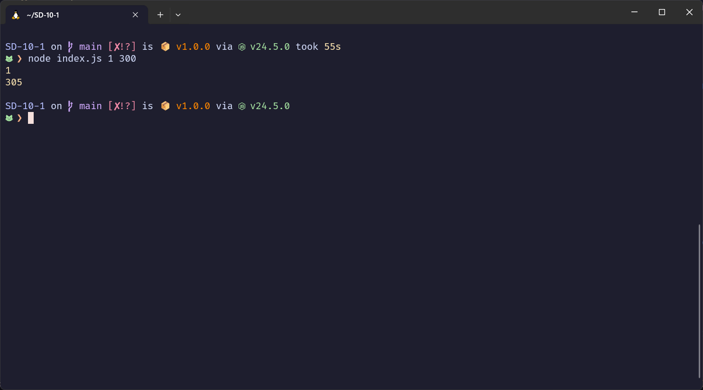

# Parte práctica laboratorio 12

## Requisitos previos

Editor de código (ej. VS Code).

Node.js instalado (para ejecutar programas en la terminal).

## Preparación

Clonar el respositorio
```bash
git clone sshurl
```
Moverse al repositorio clonado
```bash
cd nombreDelRepo
```

Instalar las dependencias
```bash
npm install
```
Abrir en vscode
```bash
code .
```

## Instrucciones

Los módulos son archivos separados para contener código y datos. Puedes elegir importar todo, o especificar qué importar.

### Importante ⚠️⚠️⚠️

Para ejecutar y probar tus funciones deberas usar el index.js de la siguiente manera:

Por ejemplo para probar la función del archivo **task1.js**

```bash
node index.js 1 200
```
Donde el argumento después del archivo index.js es el número del task a ejecutar en el ejemplo sería task1.js

El argumento siguiente del número de archivo task a ejecutar, es el valor que pide como parametro tu función. 

Imagen de ejemplo:



## Tareas

Una API web permite que nuestras aplicaciones se comuniquen, soliciten recursos y reciban respuestas a través de Internet. 

Para su evaluación final de módulo, escribirá sus propios métodos para interactuar con una API web.

Esta API web servirá una base de datos JSON que contiene una lista de usuarios. Cada usuario tendrá un número de identificación (id), un Nombre, un Apellido y una dirección de correo electrónico asociados. Aprenderá por sí mismo cómo interactuar con un módulo npm llamado **json-server**.

---

## Tarea 1  
Cree y exporte un método para devolver la URL del servidor desde el proyecto `SD-12-1: AssessmentServer-Individual`.  
- El método **getServerURL()** debería devolver la URL de su servidor JSON en funcionamiento.

---

## Tarea 2  
Cree y exporte un método para imprimir una lista de usuarios desde el servidor JSON.  
- El método **listUsers()** debería simplemente imprimir la respuesta JSON completa, que contiene la lista de usuarios, en la consola.

---

## Tarea 3  
Cree y exporte un método para agregar un nuevo usuario al servidor JSON.  
- El método **addUser()** debe:  
  - Tomar tres entradas de la siguiente manera: `addUser(<primer_nombre>, <apellido>, <correo_electrónico>)`.  
  - Resultar en la adición de un nuevo usuario completo al servidor JSON con un nuevo número de identificación único, secuencial.  
  - Por ejemplo, si el número de identificación más alto en la lista existente es `4`, entonces este nuevo número de identificación debería ser `5`.

---

## Tarea 4  
Cree y exporte un método para eliminar a un usuario del servidor JSON.  
- El método **delUser()** debería:  
  - Tomar un número de identificación (`id`) como entrada de la siguiente manera: `delUser(<id>)`.


## Recursos útiles

[Fetch API documentación oficial](https://developer.mozilla.org/en-US/docs/Web/API/Fetch_API/Using_Fetch)

[Fetch API para principiantes con ejemplos](https://www.freecodecamp.org/espanol/news/javascript-fetch-api-para-principiantes/)